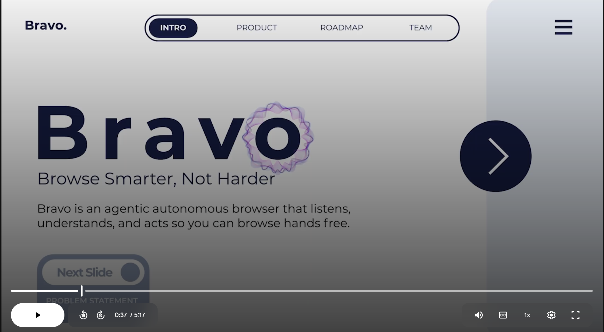
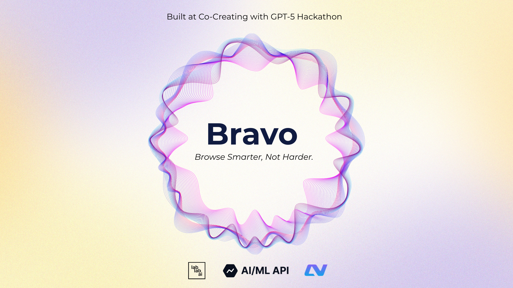

# Bravo

Click below to check the product video!

[](https://drive.google.com/file/d/1W_bGwIey7s2-50hPSet3GeAU_Q3SGfUr/view?usp=drive_link)


End-to-end setup to run:
1) Coral Server (Kotlin, SSE MCP)
2) Coral Browser Agent (Python, LangChain MCP client)
3) Bravo Electron app (UI wrapper)

## Prereqs
- macOS 12+ (you’re on darwin 24.6.0) or Linux/Windows for server/agent
- Java 21 (for `coral-server`)
- Node.js 18+ and npm (for `Bravo`)
- Python 3.13+ and `uv` (for `Coral-Browser-Agent`)
- Git, OpenSSL, Docker (optional)

Quick checks:
```bash
java -version   # 21+
node -v         # 18+
npm -v
python3 -V      # 3.13+
uv --version    # optional but recommended
```

## 0) Env files
Copy the samples and fill in keys.

```bash
cp Coral-Browser-Agent/.env_sample Coral-Browser-Agent/.env
cp Bravo/.env_sample Bravo/.env
```

Required fields to set:
- `MODEL_API_KEY` (OpenRouter/OpenAI or your provider)
- `CORAL_SSE_URL` (defaults to `http://localhost:5555/devmode/exampleApplication/privkey/session1/sse`)
- `CORAL_AGENT_ID` for the browser agent (e.g. `chrome_agent`)
- In `Bravo/.env`: `VOICE_AGENT_ID`, `BROWSER_AGENT_ID`, and any provider keys

Never commit real keys. The repo `.gitignore` ignores `*.env`.

## 1) Run Coral Server

From `coral-server`:
```bash
cd coral-server
./gradlew run          # runs SSE server on 5555 by default

# Alt modes
# ./gradlew run --args="--stdio"
# ./gradlew run --args="--sse-server 5555"
```

Verify SSE endpoint:
```
http://localhost:5555/devmode/exampleApplication/privkey/session1/sse
```

More details in `coral-server/README.md`.

## 2) Run Coral Browser Agent

From `Coral-Browser-Agent` (uses Python, LangChain, MCP client):
```bash
cd Coral-Browser-Agent

# Install deps (uv recommended; falls back to pip if needed)
uv sync || pip install -r <(uv pip compile pyproject.toml 2>/dev/null || echo '') || pip install -U pip && pip install -r requirements.txt || pip install -e .

# Minimal, portable install using uv directly
uv pip install -e . || pip install -e .

# Ensure .env is populated (CORAL_SSE_URL, CORAL_AGENT_ID, MODEL_API_KEY, etc.)
python3 main.py
```

Notes:
- Depends on `python-dotenv` (already added to pyproject).
- Logs are written to `Coral-Browser-Agent/logs/`.
- Agent registers to Coral via SSE with `agentId=$CORAL_AGENT_ID` and loops on `wait-for-mentions`.

## ElevenLabs Python SDK install (for `Voice-Agent`)

Install the ElevenLabs Conversational AI SDK:

```bash
pip install elevenlabs

# For default audio input/output support (PyAudio extra):
pip install "elevenlabs[pyaudio]"

# or with Poetry
poetry add elevenlabs "elevenlabs[pyaudio]"
```

Note: The `pyaudio` extra may require system dependencies. See the official docs: [ElevenLabs Python SDK Installation](https://elevenlabs.io/docs/conversational-ai/libraries/python#installation).

System deps for `pyaudio`:

```bash
# Linux (Debian/Ubuntu)
sudo apt-get update
sudo apt-get install libportaudio2 libportaudiocpp0 portaudio19-dev libasound-dev libsndfile1-dev -y

# macOS (Homebrew)
brew install portaudio
```

## 3) Run Bravo (Electron app)

From `Bravo`:
```bash
cd Bravo
npm install
npm run start
```

The app opens a floating orb and main window. Ensure `Bravo/.env` contains compatible values with your Coral server and agents.

Build installers (optional):
```bash
npm run dist
```

## Typical local workflow
Terminal A:
```bash
cd coral-server && ./gradlew run
```

Terminal B:
```bash
cd Coral-Browser-Agent && uv pip install -e . && python3 main.py
```

Terminal C:
```bash
cd Bravo && npm install && npm run start
```

## Troubleshooting
- Port 5555 in use: change `--sse-server <port>` and update `CORAL_SSE_URL`.
- Browser Agent won’t start: check `.env` fields, Python version, internet access for model provider.
- Electron shows no responses: confirm the agent is connected and the server logs show threads/messages.

## Repo map
```
coral-server/               # Kotlin SSE MCP server
Coral-Browser-Agent/        # Python MCP client (web browser agent)
Bravo/                      # Electron app (UI)
Voice-Agent/                # ElevenLabs voice agent (optional)
```
<p align="center">
  
</p>
